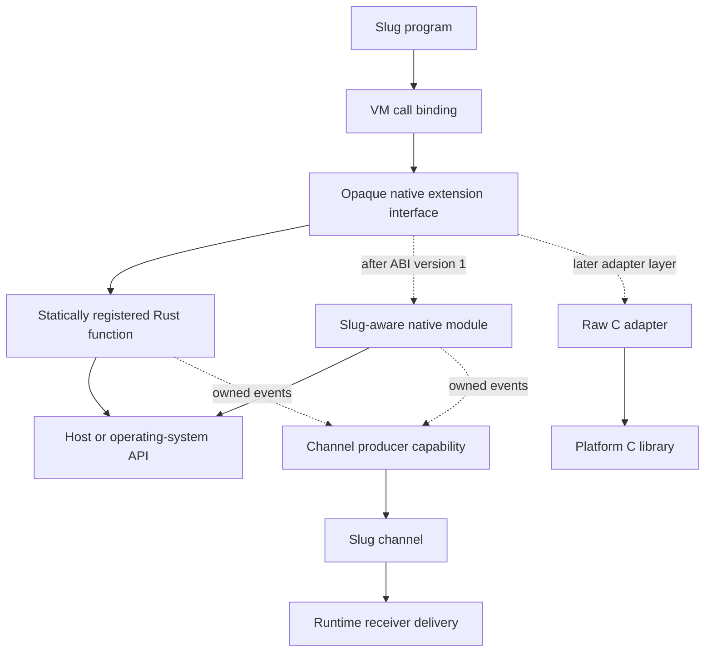
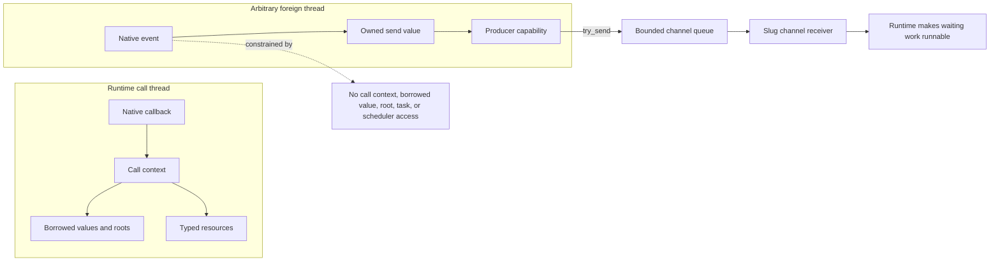

# Native extension interface

## Status and purpose

This document defines the native extension boundary that the Rust runtime must
establish before it implements channels and structured concurrency. It is an
architecture contract, not a source-language specification. Slug programs
continue to observe the rules in `language/`; this interface defines how trusted
host code supplies those rules without depending on VM internals.

The interface is a design contract only. No public binary ABI version, C header,
dynamic loader, or external native module is implemented or accepted yet. The
initial Rust API may change while channels and concurrency exercise the design.
A public ABI becomes a compatibility promise only when version 1 is published
with its C-compatible declarations and conformance tests.

The terms in this document are intentionally distinct:

- the **native extension interface** is the VM-facing contract for calls,
  values, errors, resources, and channel producers;
- the **native module ABI** is the future C-compatible binary representation of
  that contract;
- the **FFI** discovers modules and binds `foreign` declarations to functions;
- a **raw C bridge** adapts an arbitrary platform C signature to the native
  module ABI.

## Boundary and dependency direction

The VM exposes one opaque interface to all native functions. Native code adapts
that interface to Rust, operating-system APIs, or external libraries. It never
receives VM stack offsets, bytecode objects, `Value` layouts, task objects,
nursery objects, or scheduler entry points.



Channels are the only asynchronous event boundary in the first interface.
Native code may return a channel receiver or a resource containing one, retain
the corresponding producer capability, and publish events through that
capability. Publishing an event does not expose the task that may receive it or
the scheduler operation that makes that task runnable.

## Function registration

A registered function descriptor contains:

- a module-qualified binding name;
- its positional arity and, when present, the declared Slug signature;
- an execution class of `inline` or `blocking`;
- a function pointer and opaque module-owned state;
- the module identity that owns the function and its resources.

Registration rejects duplicate module-qualified signatures and malformed
descriptors before source evaluation. Named/default/variadic Slug call binding
is completed by the VM before the native callback begins. A callback therefore
observes an ordered, already-bound argument list; it does not implement Slug's
call-binding rules.

An `inline` callback runs on a VM execution thread and MUST return promptly. It
is suitable for conversion, arithmetic, and operations that cannot wait on I/O,
locks held by unrelated code, or external processes. A `blocking` callback has
the same synchronous call semantics, but the runtime MAY execute it on a
bounded blocking worker service so it does not stall a cooperative executor.
Calling a blocking function still occupies its Slug task until the function
returns. `spawn` makes that call concurrent with its caller; it does not turn
the call into an asynchronous ABI operation.

The worker count and queue policy are host resource limits. They are separate
from `nursery limit N`, whose language-level admission and ownership semantics
remain defined by the runtime requirements.

## Call contract

Every native function has one conceptual signature:

```text
native_call(call_context, module_state) -> native_status
```

`call_context` is opaque and valid only for the dynamic extent of the callback.
Through it, the callback can:

1. inspect the argument count and read argument slots;
2. test a value kind and perform checked conversions;
3. construct Slug values and opaque native resources;
4. set exactly one return value; or
5. raise exactly one structured native error.

Argument slots and temporary value references are borrowed from the call. They
MUST NOT be stored, used after return, or used from another thread. The callback
MUST return one of these statuses:

- `ok`, after setting one result (including explicit `nil`);
- `error`, after setting one structured error;
- `contract_violation`, for a malformed host callback result.

The runtime converts a reported error into the ordinary checked Slug error path
with the source call span and Slug call frames attached. A native error contains
a stable, module-owned error code, a UTF-8 message, and optional Slug data. Host
panic, Rust unwind, C++ exception, or other non-local exit MUST NOT cross the
callback boundary. The Rust facade catches unwinds where possible; external
modules are responsible for containing their language's failure mechanism.

Version 1 does not permit a callback to suspend, resume later, recursively call
Slug, or enter the VM from another thread. Those operations require a separate
future decision rather than an accidental extension of the call context.

## Values and retention

The native interface exposes values through opaque borrowed references and API
operations. It never exposes Rust enums, reference counts, collection storage,
strings owned by the VM, or raw object pointers.

Within a call, native code may read `nil`, booleans, integers, floats, strings,
bytes, lists, maps, structs, functions, channels, and native resources through
kind-specific operations. A conversion either succeeds or reports a checked
type/range error; numeric narrowing is never implicit. UTF-8 strings and byte
slices borrowed from a value have the same lifetime as the call unless copied.

A function that needs a Slug value after the call must request a **persistent
root**. A root is an opaque, reference-counted runtime token, not a pointer. Root
creation, cloning, reading, and release are runtime-call-thread-only in version
1. A root may be read during a later callback authorized by the same runtime; it
cannot be inspected directly between callbacks. Roots keep values alive but do
not make non-transferable values safe to use from foreign threads. Modules must
release roots explicitly; the runtime also releases all remaining roots when
their module instance is destroyed.

Cross-thread producers do not use roots. They construct an **owned send value**
using the thread-safe producer API. The initial transferable set is `nil`,
boolean, integer, float, UTF-8 string, bytes, and recursively composed lists and
maps of transferable values. Construction owns or copies all memory. Functions,
closures, task handles, channel receivers, persistent roots, and arbitrary
native resources are not transferable. A later ABI version may add an
explicitly shareable resource capability without changing ordinary roots.

This separation permits the current Rust VM to replace its `Rc`-based value
representation before concurrency without making that representation an ABI
promise.

## Native resources

A native resource is represented in Slug by an opaque runtime handle containing
three identities:

- the module instance that owns its implementation;
- a registered resource type within that module;
- one resource instance.

Handle access validates all three identities. A module cannot cast a handle
created by another module or by another registered type. Pointer values and
integer addresses are never exposed as Slug values.

A resource type registers an explicit close operation and a destructor. Close
MUST be idempotent and is the reliable way for Slug code or a library wrapper
to release external resources. Destruction is a fallback: its timing is not
observable, it MUST NOT call Slug or block indefinitely, and failures cannot be
raised into an arbitrary Slug task. A destructor may only release host state or
request cancellation through a thread-safe host primitive.

The runtime retains a module instance while any of its functions, resources,
roots, or producer capabilities remain live. Version 1 does not unload a native
module during a runtime instance; process or runtime teardown releases it only
after those dependants have settled.

Resource payloads are call-thread-only unless their registered type explicitly
declares a thread-safe host implementation. That declaration does not make the
corresponding Slug handle an owned send value.

## Channel producer capability

The channel runtime may issue a native producer capability paired with a Slug
channel receiver. The producer is opaque, cloneable, reference-counted, and is
the only version 1 interface operation that can publish Slug-visible work from
an arbitrary thread.

The thread-safe producer API provides:

- construction of owned send values;
- `try_send(producer, owned_value)`;
- `close(producer)`;
- producer cloning and release; and
- a closed-state query suitable for cooperative cancellation.

`try_send` is non-blocking and consumes the owned value only when accepted. It
returns `sent`, `full`, or `closed`. The native module owns its policy for a
`full` result: retry in its own event loop, coalesce, drop when its documented
API permits that, or close with an error event. The ABI does not create an
unbounded queue and does not block a foreign event-loop thread. Channel close
remains idempotent; sending after close fails without waking or naming a task.

Dropping the Slug receiver or explicitly closing the resource that owns an
operation eventually makes the producer report `closed`. Native operations
must treat that result as a cancellation request and stop publishing. This is a
resource-lifetime signal, not access to task or nursery cancellation state.

Ordinary Slug-to-Slug channel sends are runtime operations and may carry the
full set of values permitted by the language. The restricted owned send value
exists only because a foreign thread cannot safely borrow VM-owned values.

## Threading and reentrancy rules

Interface operations fall into two explicit classes:

| Class | Permitted operations |
|---|---|
| Runtime-call-thread-only | call context, borrowed values, roots, resource access, return, and error construction |
| Thread-safe | owned send-value construction, producer clone/release, `try_send`, `close`, and closed-state query |



Calling an operation from the wrong class is a host contract violation. The
runtime must diagnose violations that it can detect without exposing a host
panic to Slug. No native operation may hold an internal VM lock while invoking
module code. Version 1 has no callback from the runtime into module code except
the original function callback, explicit close, and teardown destructor.

## Versioning and memory ownership

The eventual C-compatible ABI uses opaque pointer types, fixed-width integers,
explicit byte lengths, and status codes. It does not expose Rust's ABI. The
runtime passes a function table with an ABI major version, minor version, and
table byte size. A module descriptor declares the major/minor range it accepts
and its own descriptor size.

Major versions are incompatible. Within one major version, new function-table
entries are appended and guarded by table size; existing signatures and status
meanings do not change. A loader rejects an unsupported major version or a
module requiring a newer minor/table entry before registering any function.

Memory is released by the side that allocated it. Borrowed buffers carry an
explicit lifetime, owned buffers carry the matching release operation, and
neither side calls its allocator on memory owned by the other. The version 1 C
header must make these rules concrete before dynamic loading is enabled.

The static Rust facade is version 0 and is not a compatibility promise. It must
nevertheless enforce the same lifetimes, execution classes, error outcomes,
resource identities, and thread classes so concurrency tests validate the
future binary boundary rather than a more permissive private API.

## FFI and raw C libraries

Dynamic discovery comes after the static interface, channels, and concurrency
have validated this contract. A future loader will:

1. locate a module by an explicit, host-controlled search policy;
2. load one known entry symbol;
3. negotiate the ABI version and table size;
4. validate all descriptors without partial registration; and
5. bind module-qualified `foreign` declarations to registered signatures.

A platform library such as `libm` does not become a Slug-aware module merely by
exporting C symbols. It requires a handwritten adapter or a separately
specified declarative bridge. Any TOML bridge format belongs above this ABI and
must define platform types, calling convention, library discovery, symbol
ownership, and unsafe pointer policy. It is not part of version 1.

## Deliberate exclusions

Version 1 does not expose:

- VM stacks, bytecode, runtime `Value` layout, or garbage collector hooks;
- tasks, nurseries, scheduler queues, suspension, wakeups, futures, or promises;
- native-to-Slug callbacks or arbitrary cross-thread VM entry;
- raw pointer values or unchecked casts;
- automatic binding of arbitrary C signatures;
- module unloading during a runtime instance; or
- a stable Rust source or Rust binary ABI.

## Implementation gates

Implementation proceeds in this order:

1. replace the current `fn(&[Value]) -> Result<Value, String>` boundary with a
   static Rust facade enforcing this call contract;
2. prove checked argument, result, error, root, resource, and contract-violation
   behavior with VM tests;
3. implement channels and native producer capabilities, including bounded
   cross-thread sends and close races;
4. implement structured concurrency without adding scheduler access to the
   native interface;
5. stress cancellation, cleanup, resource lifetime, blocking-worker limits,
   and runtime teardown;
6. publish the exact version 1 C declarations and ABI conformance suite; and
7. only then add dynamic loading, followed separately by any raw C bridge.

```mermaid
flowchart LR
    Facade[Version 0 Rust facade]
    Contract[Call and resource tests]
    Channels[Channels and producer capabilities]
    Concurrency[Structured concurrency]
    Stress[Lifetime and cancellation stress tests]
    ABI[Publish C ABI version 1]
    Loader[Dynamic module loading]
    Bridge[Optional raw C bridge]

    Facade --> Contract --> Channels --> Concurrency --> Stress --> ABI --> Loader --> Bridge
```



The ABI is not stable merely because these concepts are documented. Stability
begins when the version 1 binary declarations, loader validation, and tests are
released together.
