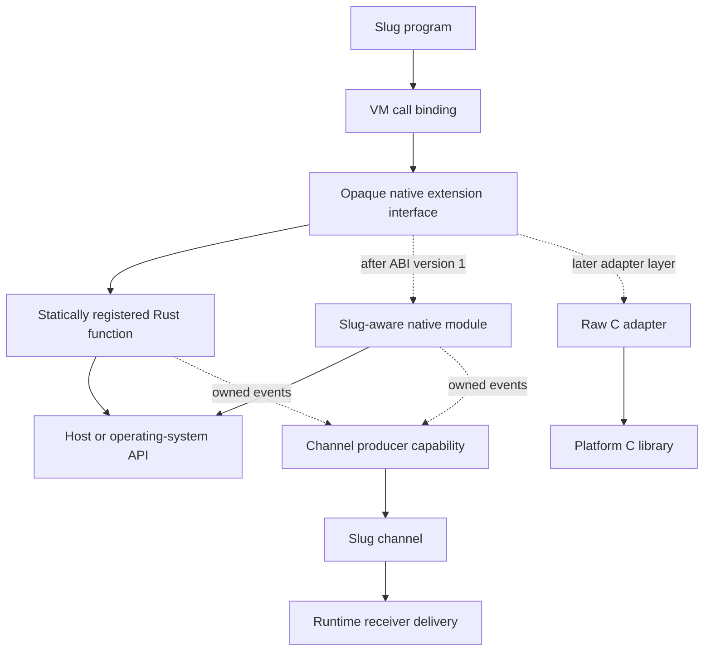
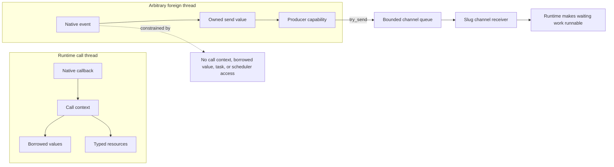
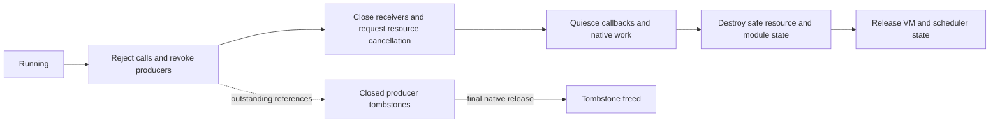

# Native extension interface

## Status and purpose

This document defines the native extension boundary that the Rust runtime must
establish before it implements channels and structured concurrency. It is an
architecture contract, not a source-language specification. Slug programs
continue to observe the rules in `language/`; this interface defines how trusted
host code supplies those rules without depending on VM internals.

The call-scoped static Rust facade implements version 0 of this design contract.
No public binary ABI version, C header, dynamic loader, or external native
module is implemented or accepted yet. The Rust API may change while channels
and concurrency exercise the design. A public ABI becomes a compatibility
promise only when version 1 is published with its C-compatible declarations and
conformance tests.

The terms in this document are intentionally distinct:

- the **native extension interface** is the VM-facing contract for calls,
  values, errors, resources, and channel producers;
- the **native module ABI** is the future C-compatible binary representation of
  that contract;
- the **FFI** discovers modules and binds `foreign` declarations to functions;
- a **raw C bridge** adapts an arbitrary platform C signature to the native
  module ABI.

## Boundary and dependency direction

The VM exposes one opaque interface to all native functions. Native code adapts
that interface to Rust, operating-system APIs, or external libraries. It never
receives VM stack offsets, bytecode objects, `Value` layouts, task objects,
nursery objects, or scheduler entry points.



Channels are the only asynchronous event boundary in the first interface.
Native code may return a channel receiver or a resource containing one, retain
the corresponding producer capability, and publish events through that
capability. Publishing an event does not expose the task that may receive it or
the scheduler operation that makes that task runnable.

## Function registration

A registered function descriptor contains:

- a module-qualified binding name;
- its positional arity and, when present, the declared Slug signature;
- a function pointer and opaque module-owned state;
- the module identity that owns the function and its resources.

Registration rejects duplicate module-qualified signatures and malformed
descriptors before source evaluation. Named/default/variadic Slug call binding
is completed by the VM before the native callback begins. A callback therefore
observes an ordered, already-bound argument list; it does not implement Slug's
call-binding rules.

The version 0 registry has one native descriptor for each `(module, local
name)` pair. Repeated compatible source `foreign` declarations therefore share
that implementation, even when static overload selection distinguishes their
private callable identities. Version 1 needs an explicit, source-independent
foreign-member selector before it can register distinct native implementations
for same-name overloads; this selector is an ABI design gate, not an implicit
registration order or a source-type string.

The version 0 `Vm::define_native` API is a temporary adapter that installs one
descriptor under its local name in a VM global environment. Descriptors retain
their module-qualified identity, while the module-qualified registry used to
resolve `foreign` declarations remains part of the later public-library and FFI
milestone.

Every native callback is synchronous. It runs as part of the calling Slug task
and occupies that task's execution capacity until it returns. Registration does
not classify a function as inline, blocking, asynchronous, or otherwise advise
the scheduler.

A caller that wants a blocking native operation to proceed concurrently uses
ordinary `spawn`; an event-driven native integration returns a channel and
publishes through its producer capability. How the runtime maps runnable Slug
tasks to host workers remains entirely inside the concurrency implementation.
The native interface creates no second worker queue or resource budget beside
the nursery and scheduler model.

An admitted task remains admitted while it is inside a blocking native call,
following the ordinary nursery rule that its permit is released when the task
terminates. The concurrency implementation must therefore tolerate execution
workers blocking in native code while preserving the progress guarantees it
chooses to provide; the ABI does not compensate with hidden offloading.

## Call contract

Every native function has one conceptual signature:

```text
native_call(call_context, module_state) -> native_status
```

`call_context` is opaque and valid only for the dynamic extent of the callback.
Through it, the callback can:

1. inspect the argument count and read argument slots;
2. test a value kind and perform checked conversions;
3. construct Slug values and opaque native resources;
4. set exactly one return value; or
5. raise exactly one structured native error.

Argument slots and temporary value references are borrowed from the call. They
MUST NOT be stored, used after return, or used from another thread. The callback
MUST return one of these statuses:

- `ok`, after setting one result (including explicit `nil`);
- `error`, after setting one structured error.

Returning `ok` without one result, returning `error` without one error, setting
both outcomes, using an invalid handle, or returning an unknown status is a
host contract violation diagnosed by the runtime. `contract_violation` is not a
status that a callback selects for itself. The runtime must contain and report
detectable violations without exposing a host panic as a Slug diagnostic.

The runtime converts a reported error into the ordinary checked Slug error path
with the source call span and Slug call frames attached. A native error contains
a stable, module-owned error code, a UTF-8 message, and optional Slug data. Host
panic, Rust unwind, C++ exception, or other non-local exit MUST NOT cross the
callback boundary. The Rust facade catches unwinds where possible; external
modules are responsible for containing their language's failure mechanism.

The version 0 Rust facade installs one process-wide panic-hook wrapper. It
delegates ordinary panics to the hook that was active at installation and
suppresses hook output only while the current thread is inside a native
callback, close operation, or destructor. A host that replaces the process hook
afterward assumes responsibility for preserving that containment behavior.

Version 1 does not permit a callback to suspend, resume later, recursively call
Slug, or enter the VM from another thread. Those operations require a separate
future decision rather than an accidental extension of the call context.

## Values and transfer

The native interface exposes values through opaque borrowed references and API
operations. It never exposes Rust enums, reference counts, collection storage,
strings owned by the VM, or raw object pointers.

Within a call, native code may read `nil`, booleans, integers, floats, strings,
bytes, lists, maps, structs, functions, channels, and native resources through
kind-specific operations. A conversion either succeeds or reports a checked
type/range error; numeric narrowing is never implicit. UTF-8 strings and byte
slices borrowed from a value have the same lifetime as the call unless copied.
A callback may return a value it constructs during that call; the runtime takes
ownership of the successful result before invalidating the call context.

Version 1 has no persistent arbitrary Slug-value root. Without native-to-Slug
callbacks, channels and resources do not yet provide a concrete consumer that
justifies freezing a rooting API or constraining a future garbage collector.
Native resources may retain host-owned data and producer capabilities, but not
borrowed Slug values. A future root design requires its own use case and
lifetime decision.

Cross-thread producers construct an **owned send value** using the thread-safe
producer API. The version 1 transferable set is deliberately limited to `nil`,
boolean, integer, float, UTF-8 string, and bytes. String and byte construction
copies or takes explicit ownership of all memory. Functions, closures, lists,
maps, structs, task handles, channel receivers, and native resources are not
transferable.

Native integrations can encode a compound event as bytes or return a typed
resource with synchronous accessor functions. A later ABI version may add
compound values or an explicitly shareable resource capability after concrete
consumers establish construction, failure-cleanup, and backpressure needs.

This separation permits the current Rust VM to replace its `Rc`-based value
representation before concurrency without making that representation an ABI
promise.

## Native resources

A native resource is represented in Slug by an opaque runtime handle containing
three identities:

- the module instance that owns its implementation;
- a registered resource type within that module;
- one resource instance.

Handle access validates all three identities. A module cannot cast a handle
created by another module or by another registered type. Pointer values and
integer addresses are never exposed as Slug values.

A resource type registers an explicit close operation and a destructor. Close
MUST be idempotent and is the reliable way for Slug code or a library wrapper
to release external resources. Destruction is a fallback: its timing is not
observable, it MUST NOT call Slug or block indefinitely, and failures cannot be
raised into an arbitrary Slug task. A destructor may only release host state or
request cancellation through a thread-safe host primitive.

The runtime retains a module instance while any of its functions or resources
remain live. A producer capability is runtime-owned and does not refer back to
module state. Version 1 does not unload native library code during a runtime
instance or while native work may still execute it.

Resource payloads are accessible only through a native call context. Multiple
Slug tasks may call functions using the same resource concurrently, so the
native implementation must synchronize its host state or reject concurrent use
with a checked error. Version 1 has no resource `thread_safe` registration flag,
and resource thread safety is not Slug-visible scheduling policy. A resource
handle never becomes an owned send value merely because its host implementation
uses thread-safe storage.

## Channel producer capability

The channel runtime may issue a native producer capability paired with a Slug
channel receiver. The producer is opaque, cloneable, reference-counted, and is
the only version 1 interface operation that can publish Slug-visible work from
an arbitrary thread.

The thread-safe producer API provides:

- construction of owned send values;
- `try_send(producer, owned_value)`;
- `close(producer)`;
- producer cloning and release; and
- a closed-state query suitable for cooperative cancellation.

`try_send` is non-blocking and consumes the owned value only when accepted. A
`full` or `closed` result returns ownership to the native module. It returns
`sent`, `full`, or `closed`. The native module owns its policy for a `full`
result: retry in its own event loop, coalesce, drop when its documented API
permits that, or close with an error event. The ABI does not create an
unbounded queue and does not block a foreign event-loop thread. Channel close
remains idempotent; sending after close fails without waking or naming a task.
For a paired receiver, native mailbox entries and ordinary Slug buffered
messages share its one configured capacity.

Dropping the Slug receiver or explicitly closing the resource that owns an
operation eventually makes the producer report `closed`. Native operations
must treat that result as a cancellation request and stop publishing. This is a
resource-lifetime signal, not access to task or nursery cancellation state.

Ordinary Slug-to-Slug channel sends are runtime operations and may carry the
full set of values permitted by the language. The restricted owned send value
exists only because a foreign thread cannot safely borrow VM-owned values.

## Threading and reentrancy rules

Interface operations fall into two explicit classes:

| Class | Permitted operations |
|---|---|
| Runtime-call-thread-only | call context, borrowed values, resource access, return, and error construction |
| Thread-safe | owned send-value construction, producer clone/release, `try_send`, `close`, and closed-state query |



Calling an operation from the wrong class is a host contract violation. The
runtime must diagnose violations that it can detect without exposing a host
panic to Slug. No native operation may hold an internal VM lock while invoking
module code. Version 1 has no callback from the runtime into module code except
the original function callback, explicit close, and teardown destructor.

## Shutdown and capability revocation

Runtime shutdown does not depend on every native producer voluntarily releasing
its capability. The runtime follows this order:

1. stop accepting new Slug calls into native modules;
2. atomically revoke every producer capability and close its receiver, so all
   current and future `try_send` operations return `closed`;
3. request idempotent close or cancellation of live native resources;
4. allow in-flight callbacks and cooperative native operations to quiesce;
5. destroy quiesced resources and module-instance state; and
6. release the remaining VM values and scheduler state.

Revocation detaches a producer from the channel and leaves a small,
runtime-independent tombstone valid until the final native reference is
released. The tombstone can report its closed state, answer `try_send` with
`closed`, be cloned, and be released; it cannot reach the destroyed VM.
Outstanding producer references therefore do not keep runtime shutdown open
and cannot publish after shutdown begins. Cloning retains the same tombstone
identity; it does not recreate a channel, queue, or other VM-facing state.

A host may impose a teardown deadline. The runtime MUST NOT wait indefinitely
for a native thread that ignores closure or cancellation. If native work does
not quiesce, the runtime reports a host contract violation and retains the
minimum state needed for memory safety rather than unloading code or freeing
state still in use. Version 1 native library code remains loaded for the host
process lifetime.



## Versioning and memory ownership

The eventual C-compatible ABI uses opaque pointer types, fixed-width integers,
explicit byte lengths, and status codes. It does not expose Rust's ABI. The
runtime passes a function table with an ABI major version, minor version, and
table byte size. A module descriptor declares the major/minor range it accepts
and its own descriptor size.

Major versions are incompatible. Within one major version, new function-table
entries are appended and guarded by table size; existing signatures and status
meanings do not change. A loader rejects an unsupported major version or a
module requiring a newer minor/table entry before registering any function.

Memory is released by the side that allocated it. Borrowed buffers carry an
explicit lifetime, owned buffers carry the matching release operation, and
neither side calls its allocator on memory owned by the other. The version 1 C
header must make these rules concrete before dynamic loading is enabled.

The static Rust facade is version 0 and is not a compatibility promise. It must
nevertheless enforce the same lifetimes, error outcomes, resource identities,
thread classes, and shutdown rules so concurrency tests validate the future
binary boundary rather than a more permissive private API.

## FFI and raw C libraries

Dynamic discovery comes after the static interface, declared-foreign registry,
channels, and concurrency have validated this contract. The version 0 Rust
facade registers a descriptor under its module-qualified name; a source
`foreign` declaration is the sole mechanism that exposes that descriptor to a
Slug module. A future loader will:

1. locate a module by an explicit, host-controlled search policy;
2. load one known entry symbol;
3. negotiate the ABI version and table size;
4. validate all descriptors without partial registration; and
5. bind module-qualified `foreign` declarations to registered signatures.

A platform library such as `libm` does not become a Slug-aware module merely by
exporting C symbols. It requires a handwritten adapter or a separately
specified declarative bridge. Any TOML bridge format belongs above this ABI and
must define platform types, calling convention, library discovery, symbol
ownership, and unsafe pointer policy. It is not part of version 1.

## Deliberate exclusions

Version 1 does not expose:

- VM stacks, bytecode, runtime `Value` layout, or garbage collector hooks;
- tasks, nurseries, scheduler queues, suspension, wakeups, futures, or promises;
- native-to-Slug callbacks or arbitrary cross-thread VM entry;
- persistent arbitrary Slug-value roots;
- scheduler hints or native-function execution classes;
- raw pointer values or unchecked casts;
- automatic binding of arbitrary C signatures;
- native library unloading during the host process lifetime; or
- a stable Rust source or Rust binary ABI.

## Implementation gates

Implementation proceeds in this order:

1. **Complete:** replace the former `fn(&[Value]) -> Result<Value, String>`
   boundary with a static Rust facade enforcing this call contract;
2. **Complete:** prove checked argument, result, error, resource, and
   contract-violation behavior with VM tests;
3. **Complete:** implement channels and native producer capabilities,
   including bounded cross-thread sends and close races;
4. **Complete:** implement structured concurrency without adding scheduler
   access to the native interface;
5. stress cancellation, cleanup, resource lifetime, producer revocation, and
   runtime teardown;
6. publish the exact version 1 C declarations and ABI conformance suite; and
7. only then add dynamic loading, followed separately by any raw C bridge.

```mermaid
flowchart LR
    Facade[Version 0 Rust facade]
    Contract[Call and resource tests]
    Channels[Channels and producer capabilities]
    Concurrency[Structured concurrency]
    Stress[Lifetime and cancellation stress tests]
    ABI[Publish C ABI version 1]
    Loader[Dynamic module loading]
    Bridge[Optional raw C bridge]

    Facade --> Contract --> Channels --> Concurrency --> Stress --> ABI --> Loader --> Bridge
```



The ABI is not stable merely because these concepts are documented. Stability
begins when the version 1 binary declarations, loader validation, and tests are
released together.

## Experimental C math module

The `ffi-prototype` Cargo feature contains a test-only C module experiment with
scalar `add` and `sqrt` functions. Its header, loader, and fixtures exist to
exercise opaque calls, version rejection, and structured errors; they are not
version 1 declarations and accept no third-party compatibility promise. The
prototype deliberately supports only exact arities, fixed-width and
length-delimited descriptor fields, opaque member-key dispatch, and integer
callback statuses. It keeps loaded code resident for the process lifetime and
does not bridge arbitrary C libraries. Prototype modules may allocate one
opaque module-state pointer during initialization; callbacks receive it and the
runtime calls the descriptor's teardown callback after the final module owner
releases it. Modules may also declare named opaque C resource types with one
destructor each. A callback can transfer a non-null C pointer into a Slug
`resource`, borrow that pointer only for a synchronous callback, or close the
resource by argument index. The host checks module/type identity and closed
state, and invokes the C destructor exactly once on close or final release.

The prototype also exposes an explicitly owned, thread-safe producer capability
for integer messages. C may create a channel during a callback, transfer its
receiver result to Slug, and retain the paired producer for a background thread.
The producer can send or be destroyed from that thread, but it cannot inspect
or enter the VM, retain a Slug value, or invoke Slug code.

Integer producer sends report `sent`, `full`, or `closed`. A `full` result
leaves the C caller responsible for retaining and retrying its integer; a
`closed` result ends that producer's useful lifetime and the caller destroys
the capability.

The text experiment now makes that transfer rule explicit for C-owned buffers:
the producer receives a buffer, length, and C destructor. On `sent`, the host
copies the text into its owned message and invokes the destructor. On `full`,
`closed`, or invalid UTF-8, C retains the buffer and is responsible for retry
or release. A dropped Slug receiver makes later producer sends return `closed`.

The fixtures also include a deliberately small SQLite adapter: an in-memory
database resource with execute, scalar-integer query, and close operations. It
uses callback-scoped length-delimited SQL text and maps SQLite failures to
structured native errors. Rows, transactions, and file database policy remain
outside the prototype.

The fixture also uses SQLite statements as a parent/child resource experiment:
an explicit database close is rejected while a statement is active, whereas
final resource teardown uses SQLite's deferred-close behavior so cleanup stays
safe regardless of resource drop order.
